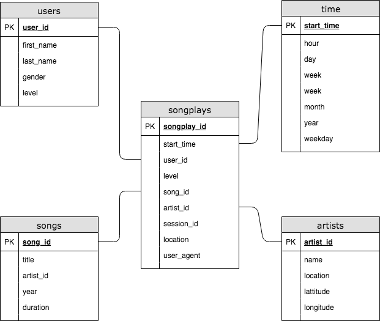

# Data Lake with Apache Spark on  AWS.

## Summary
* [Introduction](#Introduction)
* [Project Description](#Project-Description)
* [Getting Started](#Getting-Started)
* [Database Schema](#Database-Schema)
* [Prerequisites](#Prerequisites)
* [Installing](#Installing)
* [Running the tests](#Running-the-tests)
* [Built With](#Built-With)
* [Contributing](#Contributing)
* [Authors](#Authors)
* [License](#License)
* [Acknowledgments](#Acknowledgments)

## Introduction

Sparkify is a music streaming startup that provides free and paid on cloud music streaming plans and there are trying to enquire more users with paid plans. So they wanted to move from a local postgress analytic data wharehouse to a cloud based anlytics process using Amazon Redshift so that they can be more flexible on the of analyse  their users behavior and how to convert them to paid customers. 
Now because the amount of data have grown they need a more powerfull data processing tolling at big data scale.

## Project Description

The Sparkify currently have a on premisse postgress data werehouse and they want to move there analytics process to the cloud. so they will need to move  there song and log data using  json files to a amazon S3 storage service as a staging area and after that  load on a redshift databese for futher analysis.
Because the volume of data and the need of more powerfull data processing tolling they have to use apache spark to move data back and forward from S3 to redshift in parquet format which is more suitable for big data analysis, therefore there a need for more robust data warehouse. so as proposal we will build a data lake on AWS as solution for the new need.

### Getting Started
#### Run Python scripts below

etl.py: Reads data from S3, processes that data using Spark, and writes them back to S3
To run on an Jupyter Notebook powered by an EMR cluster, import the notebook found in this project.

### Database Schema
  
  
### Prerequisites

AWS accout provisioned with redshift database instance, S3 bucket,  and IAM role with admin level access to connect a redshift cluster and perform above listed operations.
and python 3.x, (local or cloud based) to run the scripts.

### Installing
Use the etl.ipynd notebook to develop the ETL process for each of tables before completing running the  etl.py file to read data from S3, processes that data using Spark, and writes them back to S3.

### Running the tests
Test by running scrits provided by analytics team, and see if the result is what was expected.

### Built With

* [Amazon Redshift](https://console.aws.amazon.com/redshift/home?region=us-east-1) - Amazon Cloud Based Database Management System.
* [Amazon IAM ](https://console.aws.amazon.com/iam/home?region=us-east-1) -  Amazon Identity and Access Management System
* [S3 buckets](https://s3.console.aws.amazon.com/s3/home?region=us-east-1#) - Amazon storage service
* [Python](https://www.python.org/) - Scripting Language
* [Apache Spark](https://spark.apache.org/) - Lightning-fast unified analytics engine

### Contributing
* **Teofilo Carlos Chichume ** 

### Authors

* **Teofilo Carlos Chichume** - *Initial work* - [nhatofo](https://github.com/nhatofo/udacity_dl)

### License

This project is licensed under the MIT License - see the [LICENSE.md](LICENSE.md) file for details

### Acknowledgments

* Inspiration [AWS Documentation](https://docs.aws.amazon.com/redshift/latest/dg/r_CREATE_TABLE_NEW.html),
[PurpleBooth](https://gist.github.com/PurpleBooth/109311bb0361f32d87a2)

